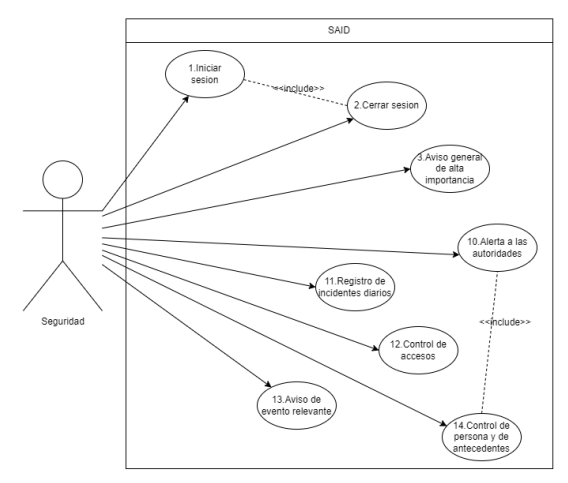
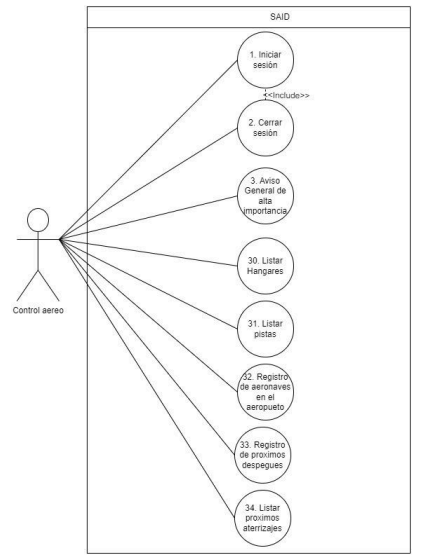

# ✈️ Sistema Integral del Aeropuerto Internacional de Denver

Proyecto académico desarrollado para la materia **Ingeniería de Software II** de la **Licenciatura en Informática**.

## 📋 Descripción

Diseño y especificación de un sistema integral destinado a centralizar las operaciones de distintos sectores del Aeropuerto Internacional de Denver.

El sistema contempla funcionalidades para múltiples actores, incluyendo personal de seguridad, control aéreo, administración, salud, limpieza, atención al público y mantenimiento, permitiendo gestionar procesos operativos desde una única plataforma.

## 🎯 Objetivos

* Centralizar la información operativa del aeropuerto.
* Mejorar la comunicación entre los distintos sectores.
* Facilitar el control y seguimiento de operaciones.
* Integrar múltiples procesos en un único sistema.
* Optimizar la gestión de recursos y servicios aeroportuarios.

## 🏗️ Actividades realizadas

### Ingeniería de Requisitos

* Elicitación de requisitos.
* Identificación de actores.
* Definición de requisitos funcionales.
* Definición de requisitos no funcionales.
* Historias de usuario.

### Modelado del Sistema

* Casos de uso.
* Análisis del dominio.
* Documentación técnica.
* Especificación de requisitos basada en IEEE 29148.

## 🖼️ Diagramas

### Casos de Uso - Seguridad

### Casos de Uso - Control Aéreo

## 📚 Documentación

La documentación completa se encuentra disponible en la carpeta `docs/`.

Incluye:

* Trabajo práctico integrador.
* Informe técnico.
* Requisitos funcionales.
* Requisitos no funcionales.
* Historias de usuario.
* Casos de uso.

## 🛠️ Metodologías utilizadas

* UML
* Ingeniería de Requisitos
* IEEE 29148
* Casos de Uso
* Historias de Usuario
* Documentación de Software

## 👨‍💻 Mi participación

Participé principalmente en:

* Ingeniería de requisitos.
* Definición de funcionalidades.
* Elaboración de casos de uso.
* Historias de usuario.
* Documentación técnica.
* Modelado del sistema.

## 📖 Aprendizajes

Este proyecto me permitió profundizar conocimientos sobre:

* Ingeniería de Software.
* Requisitos funcionales y no funcionales.
* Especificación de requisitos.
* UML.
* Casos de uso.
* Documentación técnica.
* Diseño de sistemas complejos.
